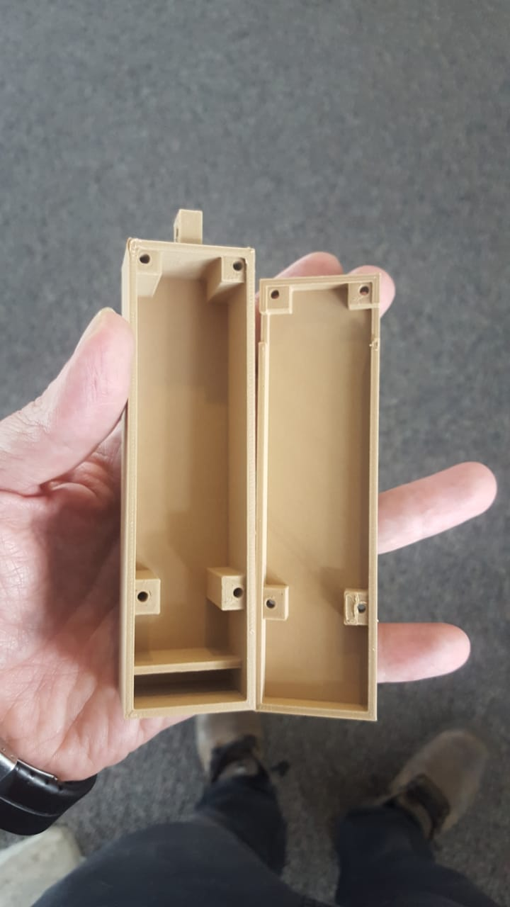
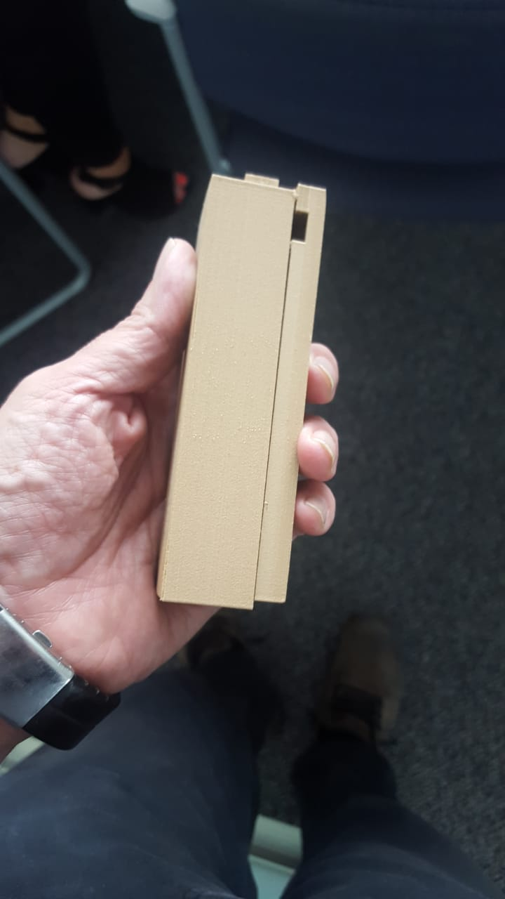

# Carcaza
## Descripción
El proyecto incluye los archivos _STL_ para la impresión de la carcaza que se muestra a continuación:

La impresión cuenta de dos componentes:

1. [Tapa](./tapa.stl)
2. [Base](./base.stl)

Ambos archivos han sido creados y dimensionados para alojar tanto el [ESP32 con Batería](https://www.banggood.com/TTGO-T-Energy-ESP32-8MByte-PSRAM-WiFi-Bluetooth-Module-18650-Battery-ESP32-WROVER-IB-Development-Board-p-1427125.html) y el acelerómetro [MPU 6050](https://www.banggood.com/6DOF-MPU-6050-3-Axis-Gyro-With-Accelerometer-Sensor-Module-For-Arduino-p-80862.html) e incluyen aperturas para el botón de encendido como para la conexión del cargador _Micro USB_

## Cambios Esperados
Debido a los cambios de requerimiento, primordialmente concentrados en usar _GPRS_ en lugar de _WiFi_, integrar funcionalidad de _GPS_ y hacer que la carcaza en si sea a prueba de agua, debido a que la mayor parte de las caidas en personas de la tercera edad se da en el baño. 